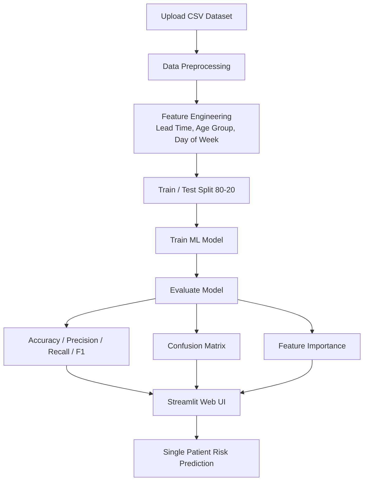

# 🏥 Clinical No-Show Prediction System

> AI-powered appointment management system that predicts patient no-shows using machine learning.

---

## 📌 Problem Statement

Appointment no-shows are a critical problem in healthcare. When patients miss appointments without cancellation:
- Clinics **lose revenue**
- Clinical staff time is **wasted**
- Other patients who needed that slot are **turned away**

In our dataset, approximately **20% of appointments result in no-shows**. This system predicts which patients are likely to miss their appointment — so clinics can act proactively.

---

## 🎯 Use Case

| Stakeholder | Benefit |
|---|---|
| Clinic Manager | Reduces wasted slots, increases revenue |
| Care Coordinator | Prioritized call list for outreach |
| Patient | Better access to care |

---

## 📊 Dataset

- **Source:** [Medical Appointment No Shows — Kaggle](https://www.kaggle.com/datasets/joniarroba/noshowappointments)
- **Size:** 110,527 appointments
- **Location:** Vitória, Espírito Santo, Brazil
- **No-Show Rate:** ~20.2%

### Key Columns

| Column | Description |
|---|---|
| `Gender` | M / F |
| `ScheduledDay` | When the appointment was booked |
| `AppointmentDay` | Actual appointment date |
| `Age` | Patient age (0–115) |
| `Scholarship` | Enrolled in Bolsa Família welfare (0/1) |
| `Hipertension` | Has hypertension (0/1) |
| `Diabetes` | Has diabetes (0/1) |
| `Alcoholism` | Has alcoholism (0/1) |
| `Handcap` | Handicap level (0–4) |
| `SMS_received` | Received SMS reminder (0/1) |
| `No-show` | **Target** — Yes = missed, No = attended |

---

## ⚙️ System Architecture



---

## 🛠️ Features

- 🤖 **3 ML Models** — Logistic Regression, Decision Tree, Random Forest
- ⚖️ **Class Imbalance Handling** — `class_weight='balanced'` on all models
- 🔮 **Single Patient Risk Scoring** — Probability score with intervention recommendation
- 🎚️ **Adjustable Threshold** — Tune precision/recall tradeoff via UI slider
- 📊 **Feature Importance Chart** — See which factors drive no-show risk

---

## 🚀 How to Run Locally

```bash
# Step 1: Install dependencies
pip3 install -r requirements.txt

# Step 2: Run the app
streamlit run app.py

# Step 3: Open browser
# http://localhost:8501
```

---

## 📁 Project Structure

```
applied-aiml/
├── app.py                  ← Streamlit UI
├── ml_pipeline.py          ← ML training & prediction pipeline
├── requirements.txt        ← Dependencies
├── README.md               ← This file
└── MILESTONE1_REPORT.md    ← Project report
```

---

## 🧠 Feature Engineering

| Feature | Description |
|---|---|
| `LeadTime` | Days between booking and appointment |
| `AgeGroup` | Age bucketed into 6 groups (child → elderly) |
| `DayOfWeek` | Day of appointment (0=Mon, 6=Sun) |
| `Gender_Male` | Binary encoding of gender |

---

## 🧰 Tech Stack

| Layer | Tool |
|---|---|
| Language | Python 3.12 |
| ML | scikit-learn |
| UI | Streamlit |
| Data | pandas, numpy |
| Hosting | Hugging Face Spaces |

---