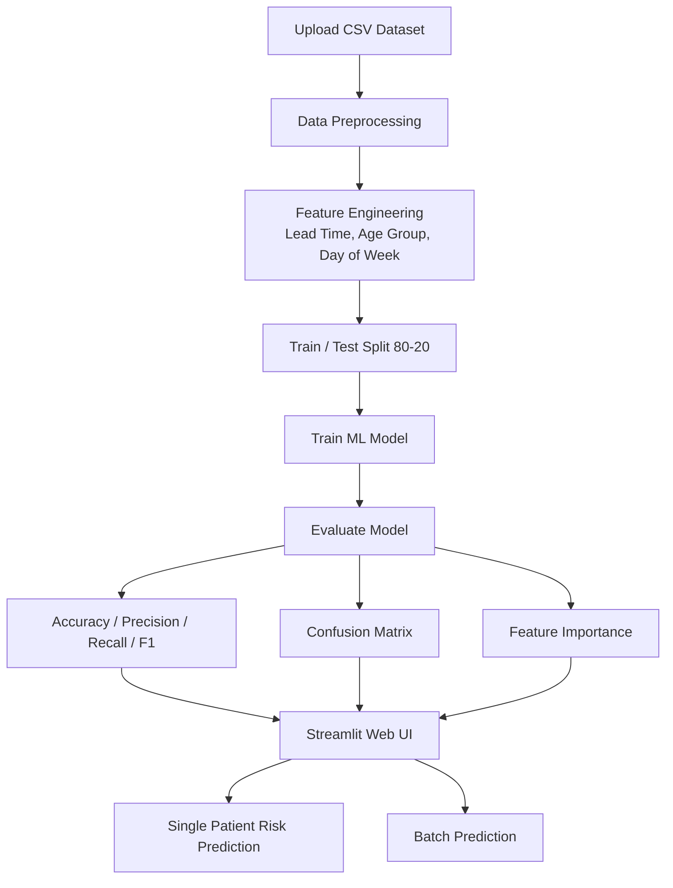

# 🏥 Clinical No-Show Prediction System

> AI-powered appointment management system that predicts patient no-shows using machine learning.

---

## 📌 Problem Statement

Appointment no-shows are a critical problem in healthcare. When patients miss appointments without cancellation:
- Clinics **lose revenue**
- Clinical staff time is **wasted**
- Other patients who needed that slot are **turned away**

In our dataset, approximately **20% of appointments result in no-shows**. This system predicts which patients are likely to miss their appointment — so clinics can act proactively.

---

## 🎯 Use Case

| Stakeholder | Benefit |
|---|---|
| Clinic Manager | Reduces wasted slots, increases revenue |
| Care Coordinator | Prioritized call list for outreach |
| Patient | Better access to care |

---

## 📊 Dataset

- **Source:** [Medical Appointment No Shows — Kaggle](https://www.kaggle.com/datasets/joniarroba/noshowappointments)
- **Size:** 110,527 appointments
- **Location:** Brazil
- **No-Show Rate:** ~20.2%

---

## ⚙️ System Architecture

---

## 🛠️ Features

- 📊 **EDA Dashboard** — Interactive Plotly charts for data exploration
- 🤖 **4 ML Models** — Logistic Regression, Decision Tree, Random Forest, Gradient Boosting
- ⚖️ **Class Imbalance Handling** — SMOTE oversampling
- 🔮 **Single Patient Risk Scoring** — Gauge chart with intervention recommendation
- 📋 **Batch Prediction** — Upload CSV, score all patients, download results

---


## 🚀 How to Run Locally
```bash
# Step 1: Install dependencies
pip3 install -r requirements.txt

# Step 2: Run the app
streamlit run app.py

# Step 3: Open browser
# http://localhost:8501
```

---

## 📁 Project Structure
```
applied-aiml/
├── app.py                  ← Streamlit UI
├── ml_pipeline.py          ← ML code
├── requirements.txt        ← Dependencies
├── README.md               ← This file
└── MILESTONE1_REPORT.md    ← Project report
```

---

## 🧰 Tech Stack

- **Language:** Python 3.12
- **ML:** scikit-learn, imbalanced-learn
- **UI:** Streamlit
- **Charts:** Plotly
- **Data:** pandas, numpy
- **Hosting:** Hugging Face Spaces

---