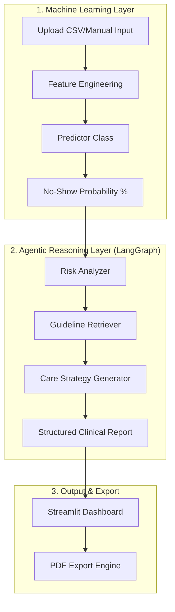

# 🏥 ClinIQ — Care Intelligence System

> An end-to-end Agentic AI system for healthcare operations that predicts patient no-shows and generates actionable care coordination strategies.

---

## 📌 Overview

ClinIQ is designed to help healthcare clinics reduce the "no-show" rate (missing appointments) through two main layers:
1.  **Predictive layer**: ML models estimate the probability of a patient missing their appointment based on historical data.
2.  **Agentic layer**: A LangGraph-powered AI agent reasons over the patient data and ML results to generate specific, actionable care interventions.

---

## 🎯 Use Case

| Stakeholder | Benefit |
|---|---|
| **Clinic Manager** | Reduces wasted slots, optimizes resource allocation, and recovers revenue. |
| **Care Coordinator** | Receives an AI-prioritized outreach list with specific talking points for high-risk patients. |
| **Medical Professional** | Accesses a comprehensive clinical report with ethical considerations and supporting sources. |

---

## ⚙️ System Architecture


```mermaid
flowchart TD
    subgraph "1. Machine Learning Layer"
    A[Upload CSV/Manual Input] --> B[Feature Engineering]
    B --> C[Predictor Class]
    C --> D[No-Show Probability %]
    end

    subgraph "2. Agentic Reasoning Layer (LangGraph)"
    D --> E[Risk Analyzer]
    E --> F[Guideline Retriever]
    F --> G[Care Strategy Generator]
    G --> H[Structured Clinical Report]
    end

    subgraph "3. Output & Export"
    H --> I[Streamlit Dashboard]
    I --> J[PDF Export Engine]
    end
```

---

## 🛠️ Key Features

- 🤖 **Multi-Model Predictive Engine** — Logistic Regression, Decision Tree, and Random Forest options.
- 🧠 **LangGraph Agentic Loop** — Uses stateful reasoning to identify risk factors and retrieve clinical guidelines (RAG).
- 🧬 **Llama 3.3 (via Groq)** — High-speed inference for generating empathetic and clinical intervention strategies.
- 📄 **On-Demand PDF Export** — Generate professional clinical reports for patient files or staff briefings.
- 🎚️ **Adjustable Intervention Threshold** — Optimize your clinic's outreach sensitivity (Precision vs. Recall).

---

## 🚀 Getting Started

### Prerequisites

- Python 3.12+
- A [Groq API Key](https://console.groq.com/) for Agentic features.

### Installation & Setup

1.  **Clone the repository**:
    ```bash
    git clone https://github.com/your-username/applied-aiml.git
    cd applied-aiml
    ```

2.  **Install dependencies**:
    ```bash
    pip install -r requirements.txt
    ```

3.  **Configure environment**:
    Create a `.env` file in the root directory:
    ```env
    GROQ_API_KEY=your_actual_api_key_here
    ```

4.  **Run the application**:
    ```bash
    streamlit run app.py
    ```

---

## 📁 Project Structure

```text
applied-aiml/
├── app.py              # Main Streamlit application
├── agent_logic.py      # LangGraph workflow & LLM integration
├── ml_pipeline.py      # ML training & prediction logic
├── pdf_generator.py    # PDF report generation (fpdf2)
├── knowledge_base.json # Mock RAG guidelines for the agent
├── style.css           # Premium UI styling
├── requirements.txt    # Project dependencies
└── .env                # API configuration (local only)
```

---

## 🧰 Technology Stack

| Layer | Technology |
|---|---|
| **Core Architecture** | [LangGraph](https://github.com/langchain-ai/langgraph) |
| **Intelligence** | [Groq](https://groq.com/) (Llama 3.3 70B) |
| **Frontend** | [Streamlit](https://streamlit.io/) |
| **ML Framework** | [scikit-learn](https://scikit-learn.org/) |
| **Data Engine** | Pandas, Numpy |
| **Reporting** | [fpdf2](https://github.com/PyFPDF/fpdf2) |

---

## ⚠️ Disclaimer

*This application is a demonstration for educational purposes. All recommendations generated by the AI should be reviewed by a qualified medical professional before clinical implementation. Data used is based on the Kaggle V2 Medical No-Shows dataset.*